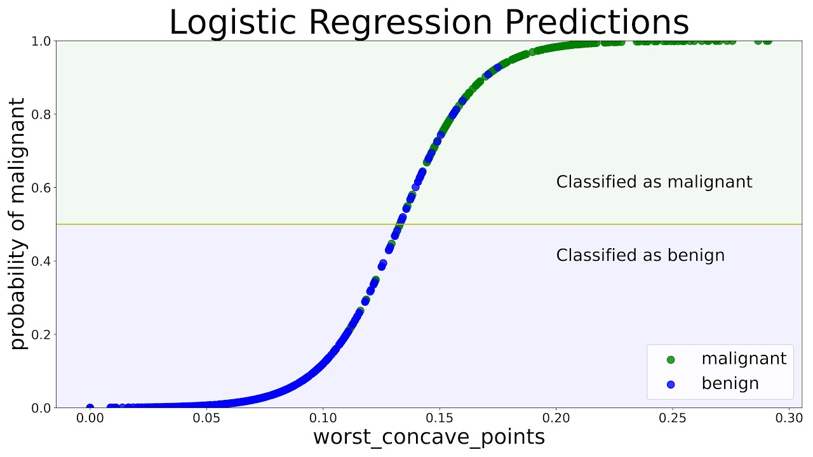
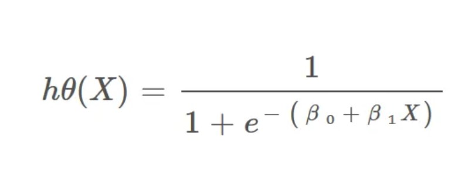

# Local Model predictions in Rust
This README outlines the rationale, steps taken, and future work on this project. 

## Background
One of the interesting patterns that I see is the wildly different performance swings of various programming languages. See [here](https://www.youtube.com/watch?v=pmLV7lCWtu4) for an example of the time taken to process 1 billion iterations for various programming languages e.g. python, rust, golang, c/c++, java, javascript.

The example in the video is fairly trivial, but this got me wondering, is it possible to implement Machine Learning models in a more performant language for production/live-services environments? To make my life slightly easier, I elected to keep the scope of the task defined. Thus I aimed to create a binary classifier using a logistic regression and DecisionTreeClassifier model in Rust. The dataset used was the Titanic survival dataset. 

NOTE: Those who have a keen eye, would know logistic regression may not be a suitable model from an AQA perspective since it assumes that there is a linear relationship between the independent variables (X) and the log odds (the logarithm of the odds) of the dependent variable and also **No Multicollinearity**. Therefore certain features were selected to ensure the model is somewhat viable but since the focus is more on developing a model that can predict directly in rust, thorough checks weren't carried out.

### but why Rust over python?
Python is awesome. I will be the first to admit this. It has good community and support meaning the learning curve is rather simple as well as having a wide-ranging application from API development, data science and Automation/Scripting. However, one of the main limitations (at least from now) is that it doesn't support  "true" parallelism due to the presence of the GIL to prevent race conditions.

The same can not be said for languages such as Rust that take advantage of memory management techniques. In the case of Rust, it uses an Ownership model which prevents race conditions at compile time thus enabling multiple tasks to execute simultaneously. Also, the fact that the language is statically typed and compiled reduces the risk of errors.

Such languages are ideal in industries where high-performance computing is carried out, i.e. in Finance where High-frequency trading results in millisecond-level decision-making in stock markets. 

## What is Logistic Regression and how can you create such a model in a performant language
Logistic regression is a binary classification technique which effectively attempts to identify whether an outcome is or isn't going to occur[1,2]. If we were to visualise a logistic regression model  which takes in a single feature (worst_concave_points) to predict the type of cancer it would look something like so:



To train a logistic regression model, Maximum Likelihood Estimation is calculated to identify the optimal weights of the features as well as the overall bias of the model. This results in a formula like so for logistic regression:



> original image found [here](https://medium.com/towards-data-science/introduction-to-logistic-regression-66248243c148)

Where beta_0/beta_1 could represent the n number of coefficients as well as the bias which is then transformed using the sigmoid function `1/1 + e^(...)` ensuring output probabilities are between 0 and 1.

## What is a DecisionTreeClassifier and how could this be implemented in rust
A Decisiontreeclassifier takes a hierarchical approach to classify outcomes. One of the main aadvantages of such a model is that is higly interpretable. For instance, below is the ASCII representation of a DecisionTree representing the liklihood an individual surives the titanic based on the features below

```ASCII 
|--- Sex_female <= 0.50
|   |--- Age <= 13.00
|   |   |--- Pclass_3 <= 0.50
|   |   |   |--- class: 1
|   |   |--- Pclass_3 >  0.50
|   |   |   |--- class: 0
|   |--- Age >  13.00
|   |   |--- Pclass_1 <= 0.50
|   |   |   |--- class: 0
|   |   |--- Pclass_1 >  0.50
|   |   |   |--- class: 0
|--- Sex_female >  0.50
|   |--- Pclass_3 <= 0.50
|   |   |--- Age <= 2.50
|   |   |   |--- class: 0
|   |   |--- Age >  2.50
|   |   |   |--- class: 1
|   |--- Pclass_3 >  0.50
|   |   |--- Age <= 38.50
|   |   |   |--- class: 0
|   |   |--- Age >  38.50
|   |   |   |--- class: 0
```
The approach I took was to train both the decision tree and logistic regression classifier models in Python (for now). I subsequently extracted the configs for models and saved then in a JSON file, enabling it to be picked up in rust. I then wrapped this into an API which when a POST request is triggered it returns the likilihood of survival. By creating an API, this helps to simulate a real-life scenario of ML models being called.

## Setup to run the project
To run the following repo, you would require the following dependencies:
- Python
- rust
- (optional) - NodeJs or [PostMan](https://www.postman.com/downloads/) to send POST requests and see potential responses.

To have your own locally hosted model on an endpoint. Run the following steps:
1. create a environments 
    
    - to create a Python environment by running `python -m venv venv` and enter your environment.
    
    - to set the environment to run the rust code run `cargo build`
2. run `pip install -r requirements.txt`
3. run `python train_model.py`
4. run `cargo run`
5. in a separate terminal if you have a node installed run `node run_predictions.js`

## Key learnings
- the performance benchmarking at least with the dataset I used and the approach I took (create an API endpoint in Rust and invoke the endpoint in Javascript) is actually **slower** than predicting in Python. There may be a reason as to why this is the case.

    - the volume of data being relatively small. This makes the modelling and prediction a relatively lightweight task. Given that parallelism was introduced into both javascript and Rust this created unnecessary overhead[4]. 
    
    - this is another reason why headline figures might not be truly representative and there is a reason why languages such as python/R/java are popular in the data community. This is also why alot of data science models in production are written in those languages.

- The ease of setup in Rust is nicer than Python. Oftentimes, there are numerous ways of configuring environments in Python e.g. conda, venv, and poetry. Whereas in Rust it is consistent across all projects.
- rust error messages were quite verbose which is a good and bad thing. This is because I very rarely had errors within my code if my code was compiled successfully. Whereas some of the errors I had were slightly annoying
- when rust code may be fast in terms of execution, compiling was rather slow.
- migrating models tree-based models to something that works in rust is an absolute pain :(

## Next steps
There are a few additional things that I would like to do:
- create a docker image with the model to ensure it is deployment "ready". This is primarily to take advantage of the compiled nature of rust by leveraging multi-stage docker builds resulting in smaller, more secure images.
- attempt to an extent "rust-ify" parts of other ML algorithms (such as tree-based classifiers/regressor, BERT model?). Interestingly I found a crate in rust known as [linfa](https://docs.rs/linfa/latest/linfa/) that aims to be a sklearn drop-in so who knows maybe I am ahead of the curve learning rust :)  


## References
[1] https://www.ibm.com/think/topics/logistic-regression 

[2] https://aws.amazon.com/what-is/logistic-regression

[3] https://www.ibm.com/think/topics/decision-trees

[4] https://stackoverflow.com/a/18334556